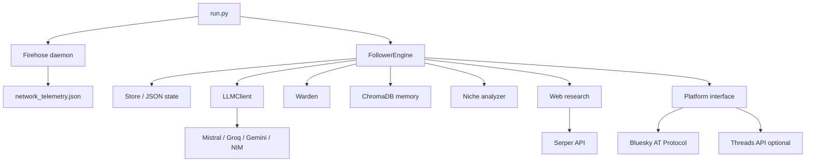

# Kiloforge: Autonomous Social Media Agent

Kiloforge is a Python-based autonomous social media agent for operating and growing a social account. The production entrypoint currently targets Bluesky as the primary source of truth, with optional write fanout to Meta Threads.

The agent does not run a fixed posting script. It continuously senses platform activity, asks an LLM strategist for intents, generates content, interacts with relevant users, records outcomes, and updates a Thompson-sampling bandit so future actions are biased toward what works for the account.

## What It Does

- Generates original Bluesky posts, replies, quotes, and thread continuations.
- Follows, likes, reposts, and replies to relevant accounts within rate budgets.
- Learns from matured actions using local follower and engagement telemetry.
- Maintains a persona and niche through `soul.yaml`.
- Stores runtime state locally under `KF_STATE_DIR` using atomic JSON writes.
- Uses ChromaDB for semantic memory, including previous interactions, self-posts, swipe-file examples, and factual knowledge.
- Optionally listens to Bluesky Jetstream firehose events for velocity and engager telemetry.
- Optionally broadcasts writes to Threads through `OmniPlatform`.

## Architecture

Kiloforge is a single-process modular monolith built around an autonomous Perception -> Reasoning -> Action -> Learning loop.

```text
+--------------------------------------------------------------------------------+
|                              KILOFORGE ENGINE                                  |
|                                                                                |
|  run.py                                                                        |
|    |                                                                           |
|    v                                                                           |
|  +----------------+     +----------------+     +-----------------------------+ |
|  | MAINTAIN       | --> | SENSE          | --> | PLAN                        | |
|  | reconcile      |     | followers      |     | strategist LLM              | |
|  | learn matured  |     | sector scans   |     | active_plan + intents       | |
|  | decay bandit   |     | firehose file  |     | IntentQueue priorities      | |
|  +----------------+     +----------------+     +-----------------------------+ |
|          ^                       |                         |                   |
|          |                       v                         v                   |
|  +----------------+     +----------------+     +-----------------------------+ |
|  | LEARN          | <-- | OBSERVE        | <-- | ACT                         | |
|  | Thompson       |     | engagement     |     | post / reply / quote        | |
|  | alpha/beta     |     | follow-backs   |     | follow / like / curate      | |
|  | keyword stats  |     | snapshots      |     | rate budgets + breaker      | |
|  +----------------+     +----------------+     +-----------------------------+ |
|                                  ^                         |                   |
|                                  |                         v                   |
|                       +--------------------+     +---------------------------+ |
|                       | SAFETY + MEMORY    | --> | PLATFORM WRITES           | |
|                       | deterministic gate |     | pending_writes.json       | |
|                       | Warden for inputs  |     | Bluesky primary           | |
|                       | ChromaDB context   |     | Threads optional fanout   | |
|                       +--------------------+     +---------------------------+ |
|                                                            |                   |
|                                                            v                   |
|                                                   +-------------------------+  |
|                                                   | AT Protocol / Threads   |  |
|                                                   +-------------------------+  |
+--------------------------------------------------------------------------------+
```



### Main Loop

`run.py` wires credentials, loads `soul.yaml`, builds the platform adapter, starts the optional firehose daemon, and repeatedly calls `FollowerEngine.orchestrate()`.

Each tick roughly does this:

1. Run maintenance: reconcile pending writes, learn from matured actions, decay bandit posteriors, refresh insights.
2. Sense the network: read follower count and scan sector activity.
3. Plan: ask the strategist LLM for prioritized intents.
4. Execute: pop one executable intent from `IntentQueue` under token-bucket constraints.
5. Persist: atomically save state and heartbeat data.

## Directory Guide

```text
.
|-- run.py                         Runtime entrypoint and process loop
|-- soul.yaml                      Persona, niche, sectors, hooks, safety additions
|-- requirements.txt               Python dependencies
|-- kiloforge.env.example          Environment variable template
|-- render.yaml                    Render worker deployment config
|-- src/
|   |-- core/
|   |   |-- engine.py              Main autonomous agent kernel
|   |   |-- store.py               Atomic JSON state and bandit persistence
|   |   |-- governance.py          RateBudget and CircuitBreaker
|   |   |-- soul.py                Typed loader for soul.yaml
|   |   `-- platform.py            Platform adapter interface
|   |-- platforms/
|   |   |-- bluesky.py             Bluesky / AT Protocol adapter
|   |   |-- threads.py             Threads Graph API adapter
|   |   `-- omni.py                Multi-platform broadcaster
|   |-- intelligence/
|   |   |-- prompts.py             LLM prompt builders
|   |   |-- strategy.py            Thompson sampling helpers
|   |   |-- analyzer.py            Niche archetype/topic analyzer
|   |   |-- memory.py              ChromaDB memory collections
|   |   |-- web_research.py        Serper-backed research pipeline
|   |   `-- meta_critic.py         Legacy strategy evaluator
|   |-- clients/
|   |   |-- llm.py                 Model routing, retries, JSON parsing, tools
|   |   `-- serper.py              Serper search/news/image client
|   |-- utils/
|   |   |-- warden.py              External-input safety and candidate grading
|   |   `-- utils.py               Engagement helper
|   `-- daemons/
|       `-- firehose_daemon.py     Bluesky Jetstream telemetry daemon
|-- data/                          Local runtime state and API caches
`-- tests/                         Test suite, some files need refactor cleanup
```

## Core Components

### `FollowerEngine`

`src/core/engine.py` is the central orchestrator. It owns the intent queue, action execution, generation flow, learning loop, curation, graph mapping, profile optimization, pending-write reconciliation, and maintenance cadence.

### `Store`

`src/core/store.py` owns durable state. All JSON writes use a temporary file followed by `os.replace`, so readers do not observe partially written files.

Important state includes:

- `engine_state.json`: tick, phase, bandit, ledger, keyword telemetry, active plan.
- `pending_writes.json`: crash-safe queue for post/reply/quote writes.
- `seen_targets.json`: deduplication keys for users, posts, and content hashes.
- `account_snapshots.json`: follower snapshots.
- `network_telemetry.json`: firehose-derived telemetry.
- `curated_list.json`: list registry.
- `web_insights.json`: research-derived signals and links.
- `chroma_db/`: vector memory.

### Platform Adapters

The engine depends on `core.platform.Platform`.

- `BlueskyPlatform` performs primary reads and writes.
- `ThreadsPlatform` supports best-effort text posting.
- `OmniPlatform` reads from the first platform and broadcasts writes to all configured platforms.

### Safety

There are two safety surfaces:

- External input is screened and summarized by `utils/warden.py` before being injected into reply prompts.
- Generated outbound text is checked by deterministic gates in `FollowerEngine._passes_gates()` for length, duplicates, URLs/spam phrases, sensitive terms, emoji, and em dashes.

Note: outbound generated content is not currently passed through the full LLM moderation path before publishing. Treat the deterministic gate as the current production safety layer unless this is changed in code.

## Crash-Safe Publishing

Posts, replies, and quote posts are not idempotent. To avoid double-posting after a partial network failure, the engine records intent before publishing.

```text
1. Generate text.
2. Write pending intent to pending_writes.json.
3. Call platform write.
4. If the response is lost, scan our author feed by content hash.
5. If found, finalize ledger and clear pending.
6. If not found after the grace window, drop stale pending intent.
```

The key implementation is `FollowerEngine._publish_with_reconcile()`.

## Setup

### 1. Create a virtual environment

```bash
python -m venv venv

# Windows
venv\Scripts\activate

# macOS/Linux
source venv/bin/activate
```

### 2. Install dependencies

```bash
pip install -r requirements.txt
```

The firehose daemon imports `websockets` dynamically. If you want Jetstream telemetry, install it too:

```bash
pip install websockets
```

### 3. Configure environment

Copy `kiloforge.env.example` to `.env` and fill in credentials.

Required for live Bluesky operation:

- `BLUESKY_HANDLE`
- `BLUESKY_PASSWORD`

Required for the current default LLM routing unless model constants are changed:

- `MISTRAL_API_KEY`

Supported optional providers/services:

- `GROQ_API_KEY`
- `GEMINI_API_KEY`
- `NVIDIA_API_KEY`
- `SERPER_API_KEY`
- `KLIPY_APP_KEY`
- `THREADS_USER_ID`
- `THREADS_ACCESS_TOKEN`
- `KF_STATE_DIR`
- `KILOFORGE_LOG_LEVEL`

Important: the current `kiloforge.env.example` and `render.yaml` do not list every optional key above. Check `src/core/config.py` and `src/clients/llm.py` before deploying with a different provider.

## Running

Live run:

```bash
python run.py
```

Dry run:

```bash
python run.py --dry-run
```

Operational note: the dry-run path currently checks for `GROQ_API_KEY`, while the main `LLMClient` routes by the model constants in `src/core/config.py`. Verify provider configuration before relying on dry-run output.

## Kill Switch

Write `HALTED` to the engine status file under `STATE_DIR`.

```bash
echo HALTED > data/engine_status.txt
```

Remove the file, or change its contents, to resume on the next loop.

## Deployment

`render.yaml` configures a Render background worker with a persistent disk mounted at `/var/lib/kiloforge` and `KF_STATE_DIR` pointed there.

Minimum deployment checklist:

- Set `BLUESKY_HANDLE` and `BLUESKY_PASSWORD`.
- Set the API key for whichever LLM provider `src/core/config.py` currently selects.
- Set `KF_STATE_DIR` to the persistent disk mount.
- Add `websockets` to dependencies if firehose telemetry is required.
- Add `SERPER_API_KEY` if research, news, or image search should work.
- Add Threads credentials only if write fanout is desired.

## Known Gaps

- `FollowerEngine` is large and should be split into scheduler, learner, publisher, generator, sourcing, and profile services.
- Some tests and legacy modules still reference old config globals such as `POST_HOOKS`, `KEYWORD_MAP`, and `PERSONA`.
- `requirements.txt` does not include `websockets`.
- `kiloforge.env.example` does not include all keys used by the current code.
- Heartbeat breaker reporting should be verified against `CircuitBreaker.state`.
- `src/intelligence/meta_critic.py` appears stale relative to the `Soul` refactor.
- Threads support is best-effort and mostly write-only.

## Development Notes

- Keep mutable runtime files under `KF_STATE_DIR`; do not introduce new state paths outside `src/core/config.py`.
- Use `Platform` methods instead of calling social APIs directly from intelligence modules.
- Wrap non-idempotent publishing writes in `_publish_with_reconcile()`.
- Prefer schema validation for new LLM responses.
- Keep `soul.yaml` responsible for domain identity and avoid hardcoding niche language in engine code.
